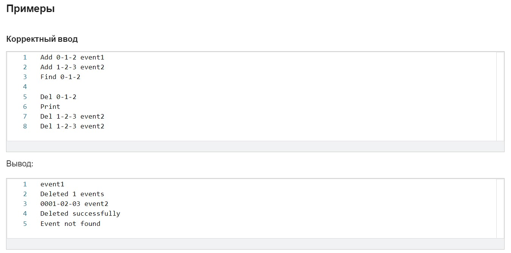

# Курсовой проект курса "Основы разработки на C++: желтый пояс"
## Введение
В курсе «Белый пояс по С++» финальным заданием была разработка базы данных, которая работала с парами (дата, событие). В этой задаче вам нужно развить эту базу данных, научив её выбирать и удалять события, удовлетворяющие заданному условию, а также разделив её код на несколько файлов.

Более подробно, ваша программа должна уметь обрабатывать набор команд:

* Add date event — добавить в базу данных пару (date, event);

* Print — вывести всё содержимое базы данных;

* Find condition — вывести все записи, содержащиеся в базе данных, которые удовлетворяют условию condition;

* Del condition — удалить из базы все записи, которые удовлетворяют условию condition;

* Last date — вывести запись с последним событием, случившимся не позже данной даты.

Условия в командах Find и Del накладывают определённые ограничения на даты и события, например:

* Find date < 2017-11-06 — найти все события, которые случились раньше 6 ноября 2017 года;

* Del event != "holiday" — удалить из базы все события, кроме «holiday»;

* Find date >= 2017-01-01 AND date < 2017-07-01 AND event == "sport event" — найти всё события «sport event», случившиеся в первой половине 2017 года;

* Del date < 2017-01-01 AND (event == "holiday" OR event == "sport event") — удалить из базы все события «holiday» и «sport event», случившиеся до 2017 года.

В командах обоих типов условия могут быть пустыми: под такое условие попадают все события.

##Структура программы
Ниже вам даны заготовки для файлов

1. condition_parser.h/cpp — в видеолекции «Задача разбора арифметического выражения. Описание решения» мы продемонстрировали построение абстрактного синтаксического дерева для арифметических выражений. Реализация этого алгоритма для разбора условий в командах Find и Del содержится в функции ParseCondition, объявленной и полностью реализованной в файлах condition_parser.h/cpp;

2. token.h/cpp — содержат готовый токенизатор, который используется в функции ParseCondition;

3. main.cpp — содержит готовую функцию main.

Вам нужно проанализировать выданный код и разработать недостающие классы и функции:

* класс Database, который представляет собой базу данных, — вы должны сами создать его публичный интерфейс, основываясь на том, как он используется в функции main;

* классы Node, EmptyNode, DateComparisonNode, EventComparisonNode и LogicalOperationNode — сформировать их иерархию и публичный интерфейс вам поможет анализ функций main и ParseCondition;

* класс Date, а также функцию ParseDate и оператор вывода в поток для класса Date.

На проверку вы должны прислать архив, состоящий из файлов:

* date.h/cpp — эти файлы должны содержать объявления и определения класса Date, функции ParseDate и оператора вывода в поток для класса Date;

* database.h/cpp — эти файлы должны содержать объявление и определение класса Database;

* node.h/cpp — эти файлы должны содержать объявления и определения класса Node, а также всех его потомков (см. выше), которые представляют собой узлы абстрактного синтаксического дерева, формируемого функцией ParseCondition;

* condition_parser.h/cpp;

* token.h/cpp;

* main.cpp;

другие .h- и .cpp-файлы, которые вы посчитаете нужным создать в своём решении.

--------------------------------------------
## Условие курсового проекта в "белом поясе"

Необходимо написать программу на С++, которая реализует работу с простой базой данных (сокращённо «БД»). Программа будет общаться с пользователем через стандартный ввод и вывод (потоки stdin и stdout).

Будем хранить в нашей БД пары вида: дата, событие. Определим дату как строку вида Год-Месяц-День, где Год, Месяц и День — целые числа. 

Событие определим как строку из произвольных печатных символов без разделителей внутри (пробелов, табуляций и пр.). Событие не может быть пустой строкой. В одну и ту же дату может произойти много разных событий, БД должна суметь их все сохранить. Одинаковые события, произошедшие в один и тот же день, сохранять не нужно: достаточно сохранить только одно из них.

Наша БД должна понимать определённые команды, чтобы с ней можно было взаимодействовать:

- добавление события:                        Add Дата Событие
- удаление события:                          Del Дата Событие
- удаление всех событий за конкретную дату:  Del Дата
- поиск событий за конкретную дату:          Find Дата
- печать всех событий за все даты:           Print

Все команды, даты и события при вводе разделены пробелами. Команды считываются из стандартного ввода. В одной строке может быть ровно одна команда, но можно ввести несколько команд в несколько строк. На вход также могут поступать пустые строки — их следует игнорировать и продолжать обработку новых команд в последующих строках.

### Добавление события (Add Дата Событие)
При добавлении события БД должна его запомнить и затем показывать его при поиске (командой Find) или печати (командой Print). Если указанное событие для данной даты уже существует, повторное его добавление нужно игнорировать. В случае корректного ввода (см. раздел «Обработка ошибок ввода») программа ничего не должна выводить на экран.

### Удаление события (Del Дата Событие)
Команда должна удалить добавленное ранее событие с указанным именем в указанную дату, если оно существует. Если событие найдено и удалено, программа должна вывести строку «Deleted successfully» (без кавычек). Если событие в указанную дату не найдено, программа должна вывести строку «Event not found» (без кавычек).

### Удаление нескольких событий (Del Дата)
Команда удаляет все ранее добавленные события за указанную дату. Программа всегда должна выводить строку вида «Deleted N events», где N — это количество всех найденных и удалённых событий. N может быть равно нулю, если в указанную дату не было ни одного события.

### Поиск событий (Find Дата)
Найти и распечатать ранее добавленные события в указанную дату. Программа должна вывести на печать только сами события, по одному на строке. События должны быть отсортированы по возрастанию в порядке сравнения строк между собой (тип string).

### Печать всех событий (Print)
С помощью этой команды можно показать полное содержимое нашей БД. Программа должна вывести на печать все пары Дата Событие по одной на строке. Все пары должны быть отсортированы по дате, а события в рамках одной даты должны быть отсортированы по возрастанию в порядке сравнения строк между собой (тип string). Даты должны быть отформатированы специальным образом: ГГГГ-ММ-ДД, где Г, М, Д — это цифры чисел года, месяца и дня соответственно. Если какое-то число имеет меньше разрядов, то оно должно дополняться нулями, например, 0001-01-01 — первое января первого года. Вам не понадобится выводить дату с отрицательным значением года.

Обработка ошибок ввода
Ввод в этой задаче не всегда корректен: некоторые ошибки ввода ваша программа должна корректно обрабатывать.

Какие ошибки ввода нужно обрабатывать
* Если пользователь ввёл неизвестную команду, то программа должна об этом сообщить, выведя строку «Unknown command: COMMAND», где COMMAND — это та команда, которую ввёл пользователь. Командой считается первое слово в строке (до пробела).

* Если дата не соответствует формату Год-Месяц-День, где Год, Месяц и День — произвольные целые числа, то программа должна напечатать «Wrong date format: DATE», где DATE — это то, что пользователь ввёл вместо даты (до пробела). Обратите внимание, что части даты разделяются ровно одним дефисом, а сама дата не должна содержать лишних символов ни перед годом, ни после дня. Части даты не могут быть пустыми, но могут быть нулевыми и даже отрицательными.

* Если формат даты верен, необходимо проверить валидность месяца и дня.

* Если номер месяца не является числом от 1 до 12, выведите «Month value is invalid: MONTH», где MONTH — это неверный номер месяца, например, 13 или -1.

* Если месяц корректен, а день не лежит в диапазоне от 1 до 31, выведите «Day value is invalid: DAY», где DAY — это неверный номер дня в месяце, например, 39 или 0.

Обратите внимание, что:

* Значение года проверять отдельно не нужно.

* Не нужно проверять календарную корректность даты: количество дней в каждом месяце считается равным 31, високосные года учитывать не нужно.

* Если неверны как месяц, так и день, то нужно вывести одно сообщение об ошибке в месяце.

Примеры:

* 1-1-1 — корректная дата;

* -1-1-1 — корректная дата (год -1, месяц 1, день 1);

* 1--1-1 — дата в верном формате, но с некорректным месяцем -1;

* 1---1-1 — дата в неверном формате: месяц не может начинаться с двух дефисов.

* 1-+1-+1 — корректная дата, так как +1 это целое число

После обработки любой из описанных ошибок ввода и печати сообщения программа должна завершать своё выполнение.

Какие ошибки ввода не нужно обрабатывать
Мы не ставим своей целью сломать вашу программу всеми возможными способами, поэтому, за исключением описанного в предыдущем пункте, вы можете полагаться на корректность ввода. В частности, мы гарантируем, что:

* Каждая команда занимает целиком ровно одну строку, хотя во вводе могут быть и пустые строки (их нужно игнорировать).

* События всегда содержат указанное количество аргументов: после команды Add всегда следуют дата и событие, после команды Find всегда следует дата, после команды Del всегда следует дата и, возможно, событие, а команда Print не содержит дополнительной информации.

* Все команды, даты и события являются непустыми строками и не содержат пробелов и прочих пробельных символов. (В частности, наши тесты не содержат команды «Add 2018-02-12», потому что в ней после даты отсутствует название события.) С другой стороны, команда Del может не содержать события после даты: в этом случае нужно удалить все события за указанную дату (см. раздел «Удаление нескольких событий»).

* Несмотря на то, что дата с отрицательным значением года считается корректной, тесты устроены так, что её не понадобится выводить в команде Print.

